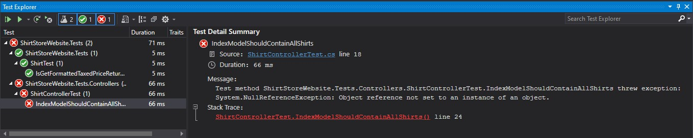
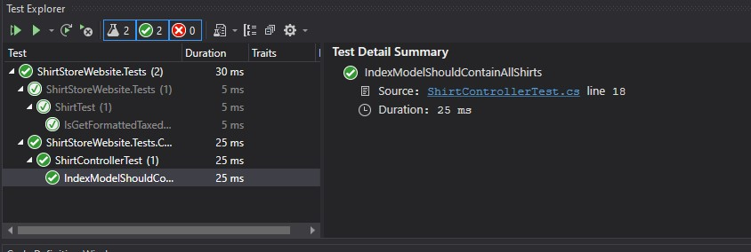

# Module 10: Testing and Troubleshooting

## Lab: Testing and Troubleshooting

1. **Nombres y apellidos:** Francisco Javier Moreno Quevedo
2. **Fecha:** 02/12/2020
3. **Resumen del Ejercicio:** Testear el modelo de la aplicacion utilizando Fake Reposiroty
4. **Dificultad o problemas presentados y como se resolvieron:** Ninguna


Ejercicio 2: Testing a Controller using a Fake Repository

- En el proyecto **ShirtStoreWebsite** añadimos la carpeta **Services** y añadimos el Interface **IShirtRepository** con el siguiente código

  

```cs
   public interface IShirtRepository
    {
        IEnumerable<Shirt> GetShirts();
        bool AddShirt(Shirt shirt);
        bool RemoveShirt(int id);
    }
```

- En el proyecto de test  implementamos el interface usando un repositorio falso
- Pasamos el repositorio falso al controlador  **ShirtController**
- Escribimos el test para el controlador  **ShirtController**

- Ejecutamos el test

  



Vemos que falla porque no se ha implementado en la clase **ShirtController**. 

La implementamos volvemos a ejecutar los test y comprobamos que ahora funciona correctamente

